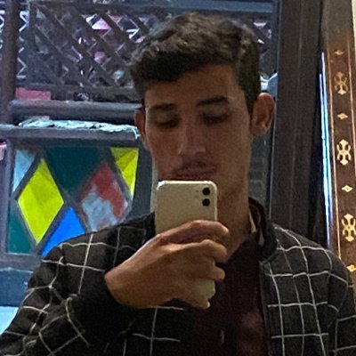

    

Hello! I’m Ahsanulhaq, a 4th-semester Software Engineering student at Islamia College University, Peshawar. I’m passionate about coding, problem-solving, and building things that matter.

Currently, I’m expanding my skills in JavaScript and Python  while diving into React.js to become a MERN-Stack Developer. Long-term, I also want to explore Machine Learning to bridge the gap between web apps and intelligent systems.

This blog documents my learning journey, achievements, and future goals.
My Skills & Projects
1. Programming Languages

    JavaScript: Building interactive web apps.

    Python: Scripting and beginner ML.

    C++: Problem-solving (DSA).

2. What I’ve Built

    Simple To-Do Apps (JavaScript).

    LeetCode Solutions

    Basic Python Automation Scripts.

My Goals
Short-Term (2024-2025)

✔ Master React.js → Build dynamic web apps.
✔ Learn Backend (Node.js + Express) → Become Full-Stack ready.
✔ Contribute to Open Source – Gain real-world experience.
Long-Term (2026 & Beyond)

✔ Work as a Full-Stack Developer – Build scalable web solutions.
✔ Explore Machine Learning – Combine AI with web apps.
✔ Freelance/Startup – Solve real problems in Pakistan’s tech space.

Why I Chose This Path?

 > Web Development: It’s creative, fast-growing, and impactful.Web

 > Machine Learning: The future of smart applications.

 > Problem-Solving: I love turning ideas into code.

How I’m Learning?

📌 Online Courses on Youtube.
📌 Practice: LeetCode, personal projects.
📌 Networking: Connecting with devs on LinkedIn and X.
Let’s Connect!

I’m open to collaborations, internships, and mentorship. Reach out if you:

> Want to code together.

> Can guide me in Full-Stack/ML.

> Are hiring junior developers.

🔗 GitHub: https://github.com/Ahsanulhaq01
📧 Email: [ulhaqahsan@gmail.com]
Final Thoughts

The journey from student to developer is challenging but exciting. Every small project, every solved problem, and every new skill gets me closer to my goals.

Stay tuned for updates! I’ll share my projects, failures, and lessons here.
